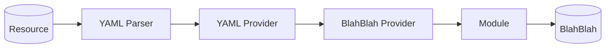

<h1 align="center">Blah-Blah</h1></br>

<p align="center">
  <a href="https://github.com/getspherelabs/blahblah"></a> <br>
</p>

Blah-Blah is a Kotlin Multiplatform (KMP) library designed to generates fake data for robust testing and development. It can be used for things such as:

- Unit Testing
- Performance Testing
- Building Demos
- Working without a completed backend

Blah-Blah's flexibility and compatibility with Kotlin Multiplatform make it an essential tool for creating high-quality applications that are thoroughly tested and well-prepared for dynamic development demands.

## Features

- It generates realistic data, enabling effective scenario simulation without relying on actual data sources.
- The library provides a solid foundation for robust testing by offering diverse datasets that mimic real-world scenarios.
- Blah-Blah supports Kotlin Multiplatform.

## Documentation 📖

- [Getting Started](https://getspherelabs.github.io/blahblah/guides/getting-started)
- [Core Concepts](https://getspherelabs.github.io/blahblah/guides/concepts)
- [Contributing](https://getspherelabs.github.io/blahblah/contribute/)

## Library Flowcharts



## Setup

Add the dependency below into your module's `build.gradle.kts` file:

```kt
// For development

// It includes blah-blah fake.
implementation("io.github.behzodhalil:blahblah-fake:<latest-version>")
// If only need yaml parser
implementation("io.github.behzodhalil:blahblah-yaml:<latest-version>")
// If only need random
implementation("io.github.behzodhalil:blahblah-random:<latest-version>")

// For testing

// It includes blah-blah fake.
testImplementation("io.github.behzodhalil:blahblah-fake:<latest-version>")
// If only need yaml parser
testImplementation("io.github.behzodhalil:blahblah-yaml:<latest-version>")
// If only need random
testImplementation("io.github.behzodhalil:blahblah-random:<latest-version>")

```
## Usage

### Testing

class BlahBlahTest {

    private lateinit var blah: BlahBlah

    @BeforeTest
    fun setup() {
        blah = blah()
      }

    @Test
    fun `check the blah blah works properly`() {
        val city = blah.address.city
        val state = blah.address.state

        assertNotNull(city)
        assertNotNull(state)
      }

    @Test
    fun `check the street address gets successfully`() {
        val streetAddress = blah.address.streetAddress


        assertNotNull(streetAddress)
        assertTrue(streetAddress.isDigit())
      } 
    }


## YamlParser

YamlParser for parsing YAML files and retrieving values organized in a specific structure.

```kt
interface YamlParser {
    fun values(): YamlResource
}

```
## YamlProvider

YamlProvider for providing values fetched from YAML resources using specified keys.

```kt
interface YamlProvider {
    fun get(key: String): String
}
```

## Provider

Provider representing a provider that retrieves content from a specified path. It is a bridge between module and yaml provider.

```kt
public interface Provider {
    public  fun get(path: Path): String
}

```
## Path

Path representing a path to a resource.It is not Okio path.

```kt
public interface Path {
    public val value: String
}

```

## License

[](LICENSE.md)
