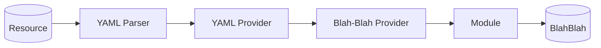

import Tabs from '@theme/Tabs';
import TabItem from '@theme/TabItem';


Blah-Blah is a Kotlin Multiplatform (KMP) library designed to generates fake data for robust testing and development. It can be used for things such as:

- Unit Testing
- Performance Testing
- Building Demos
- Working without a completed backend

Blah-Blah's flexibility and compatibility with Kotlin Multiplatform make it an essential tool for creating high-quality applications that are thoroughly tested and well-prepared for dynamic development demands.

## Features

- It generates realistic data, enabling effective scenario simulation without relying on actual data sources.
- The library provides a solid foundation for robust testing by offering diverse datasets that mimic real-world scenarios.
- Blah-Blah supports Kotlin Multiplatform.


## Why Blah-Blah?

Blah-Blah can create fake data that looks like real information. This helps you test and build things without needing actual data.

If you're showing off your app, BlahBlah can make fake data that looks real. This makes your demos look better and more interesting.

BlahBlah works with different types of platforms, like Android and iOS, which makes it easier to share code.

BlahBlah speeds up how fast you can build things by giving you fake data to start with. You don't need a real backend right away.

## Library Flowchart



## Examples

<Tabs
  defaultValue="kotlin"
  groupId="meteor-architecture"
  values={[
    {label: 'Kotlin', value: 'kotlin'}
  ]}>

  <TabItem value="kotlin">


```kt

class BlahBlahTest {

    private lateinit var blah: BlahBlah

    @BeforeTest
    fun setup() {
        blah = blah()
    }

    @Test
    fun `check the blah blah works properly`() {
        val city = blah.address.city
        val state = blah.address.state

        assertNotNull(city)
        assertNotNull(state)
    }

    @Test
    fun `check the street address gets successfully`() {
        val streetAddress = blah.address.streetAddress


        assertNotNull(streetAddress)
        assertTrue(streetAddress.isDigit())
    }
}
```

  </TabItem>
</Tabs>
